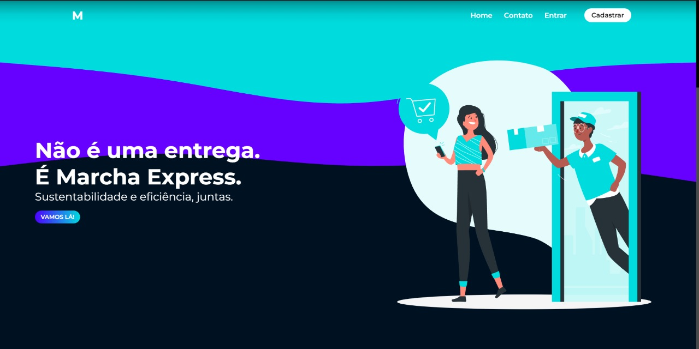
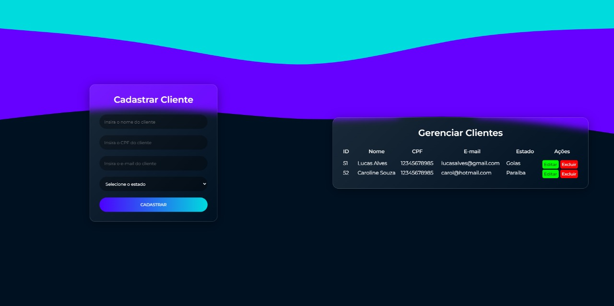

<h1> Marcha Express<br> 
Transportadora - entregas sustentáveis</h1>
<br>

<h3> Para atender a Transportadora Express-Express desenvolvemos o site para o serviço Marcha Express, com uma API REST customizada para o gerenciamento de entregas sustentáveis pela transportadora. <br>
Marcha Express é o núcleo de entrega sustentável, considerando volumes em pesos e quantidades limitadas para entregas em veículos sustentáveis, como a bicicleta. 
</h3>
<br>

<br>
<br>
<h2> Status do projeto</h2>
<h4> 
	🚧  Em construção...  🚧
</h4>
<br>

<h2>Sobre o projeto</h2>
<p> Como projeto final do módulo5 do curso de Web FullStack, desenvolvemos um site utilizando a biblioteca React e uma API-REST customizada para o tema: Transportadora, a API possui como entidades disponíveis para acesso:</p>
<li>comerciante
<li>cliente
<li>carga
<li>envio
<br>
<br>
<p>
Para realizar as requisições foi utilizado o <a href="https://axios-http.com/ptbr/" target="_blank">Axios</a>;<br>
Foi utilizado no desenvolvimento o Build tool <a href="https://vitejs.dev/" target="_blank">Vite</a>;<br>
Para o controle de routes, utilizamos a biblioteca <a href="https://reactrouter.com/en/main" target="_blank">react-router-dom</a>;<br> 
Para ajudar no desenvolvimento, utilizamos o TypeScript, que facilitou a identificação de erros e aumento de produtividade.
<br>

<h2>Como utilizar</h2>

<p> Para que o projeto rode em sua máquina, você precisará do <a href="https://git-scm.com/ target="_blank">Git</a>, <a href="https://nodejs.org/en/" target="_blank">Node.JS v16.16.0 or higher</a> + <a href="https://docs.npmjs.com/cli/v8/commands/npm-install" target="_blank">Npm v6.14.11</a>
instalados em seu computador. Se tiver curiosidade, você também poderá consultar a API e precisará de uma plataforma para rodar a API, sugerimos o <a href="https://insomnia.rest/download"target="_blank">Insomnia</a> para conseguir testar as rotas. 
</p>
<h3>Instalação do projeto</h3>

```
##Clone o repositório do backend
$ git clone git@github.com:gnlto/ExpressExpress-API.git

# Abra o repositório em seu editor de código
$ cd ExpressExpress-API

# Instale as dependências
$ npm install

# Inicie o banco de dados
$ npx sequelize-cli db:migrate

# Inicie o projeto
$ npm start

## Clone o repositório do frontend
$ git@github.com:gnlto/MarchaExpress.git

#Abra o repositório em seu editor de código
$ cd MarchaExpress

# Instale as dependências
$ npm install

# Inicie o projeto
$ npm run dev
```
<h2>Informações importantes para execução</h2>
<br>
<p><b>Para o cadastro de <i>Clientes</i></b>:
<li>o atributo Nome pode conter de 3 a 50 caracteres,
<li>o atributo CPF deve conter 11 caracteres numéricos, 
<li>o atributo email deve conter o caracter "@",
<li>o atributo estado deve ser preenchido com o nome do estado por extenso;
</p>
<br>

<br>
<p>
O gerenciamento dos clientes cadastrados é realizado pelo usuário, ele pode criar, deletar, editar e atualizar os dados dos clientes além de realizar a busca dos clientes através do número de "ID" disponibilizado na lista ao lado.
<br>
<br>
OBS: Demais funcionalidades estão em desenvolvimento.
<br>
<h2>Desenvolvedores</h2>

<li><a href="https://github.com/biateisi">Beatriz Teixeira</i>
<li><a href="https://github.com/gnlto">Gustavo Pereira</i>
<li><a href="https://github.com/LucianoFreitas16">Luciano Freitas</i>
<li><a href="https://github.com/pedrotoni">Pedro de Toni</a></li>
<br>

<h2>Tecnologias utilizadas</h2>

<p>


</p>